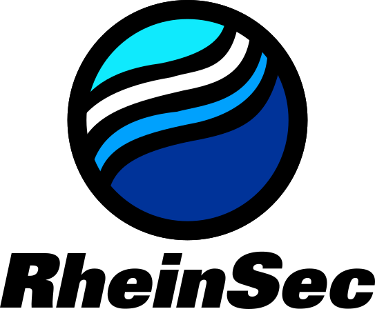

<!-- markdown project template used: https://github.com/othneildrew/Best-README-Template -->

<!-- PROJECT SHIELDS -->
[![Contributors][contributors-shield]][contributors-url]
[![Stargazers][stars-shield]][stars-url]
[![Issues][issues-shield]][issues-url]
[![MIT License][license-shield]][license-url]

 

  

<h3 align="center">First of a Kind Secure Network Key Management Solution</h3>

  A new network key storage solution for <a href="https://github.com/nmshd">Enmeshed</a>
     
  

---

<!-- ABOUT THE PROJECT -->
## 🔍 About The Project

### What is Enmeshed?
<a href="https://github.com/nmshd">Enmeshed</a> is a open source Project by j&s-soft, the project offeres a secure and feutreistic concept to extchange information or documents between People or organisations, the application uses end to end encryption for secure transfer and privacy, more information can be found [here](https://enmeshed.eu/explore/how_does_enmeshed_work)

### How does it work?
This application is designed to provide a secure method for storing keys, which are currently stored insecurely to a network-based solution. This solution will be built on Hashicorp Vault and a C# ASP .NET core outward-facing API. The API will initialize user tokens and communicate with the Vault server. 
The backend of the application should be capable of running securely with any similar application that wishes to store keys securely and retrieve them using a user token.

The client side of the application is expected to communicate with the so-called ‘Crypto Abstraction Layer’, which is yet to be released by j&s-soft.

### Why Network Key storage? 
Network key storage is designed to solve the issue of some devices not having a Hardware Security Module that is compatible with the Enmeshed application. This would still allow older, non-bleeding-edge devices to store their keys securely.

(<a href="#readme-top">back to top</a>)

---

## 👷‍♂️ Built With

* ASP .NET core 8.0.
* Hashicorp Vault 1.16.0.
* Rust for the Client side of the application.

(<a href="#readme-top">back to top</a>)

---
## 🏃 Getting Started

Since the project is still early in development, there are no releases yet. Therefore, you must run the code in an IDE. 
We recommend the following:
* JetBrains RustRover for the client-side code
* JetBrains Rider for the server-side code

Additionally, you must have a HashiCorp Vault instance running on port 8200. The root token must be put in a file called `tokens.env` in the **backend/** directory. finally, make sure that the vault is also unsealed!

More instructions will follow as the project progresses.

(<a href="#readme-top">back to top</a>)

---

[contributors-shield]: https://img.shields.io/github/contributors/cep-sose2024/rhein_sec.svg?style=for-the-badge
[contributors-url]: https://github.com/cep-sose2024/rhein_sec/graphs/contributors
[stars-shield]: https://img.shields.io/github/stars/cep-sose2024/rhein_sec.svg?style=for-the-badge
[stars-url]: https://github.com/cep-sose2024/rhein_sec/stargazers
[issues-shield]: https://img.shields.io/github/issues/cep-sose2024/rhein_sec.svg?style=for-the-badge
[issues-url]: https://github.com/cep-sose2024/rhein_sec/issues
[license-shield]: https://img.shields.io/github/license/cep-sose2024/rhein_sec.svg?style=for-the-badge
[license-url]: https://github.com/cep-sose2024/rhein_sec/blob/master/LICENSE

